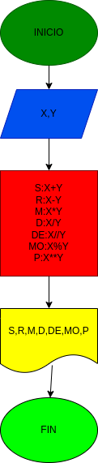

# OperacionesAritmeticas1

## programa para calcular la suma, resta, multiplicación, división, división entera, modulo y potencia de 2 numeros

# ANALISIS

Variable de Entrada (input)

S: x+y

R: x-y

M: x*y

D: x/y

DE: x//y

MO: x%y

P: x**y

Variables de proceso y salida (proccesing, storage, output)

S: suma de X y Y

R: resta de X y Y 

M: multiplicacion de X y Y 

D: division de X y Y

DE: division entera de X y Y

MO: modulo de X y Y

P: potencia de X y Y

# DISEÑO

# CONSTRUCCION
